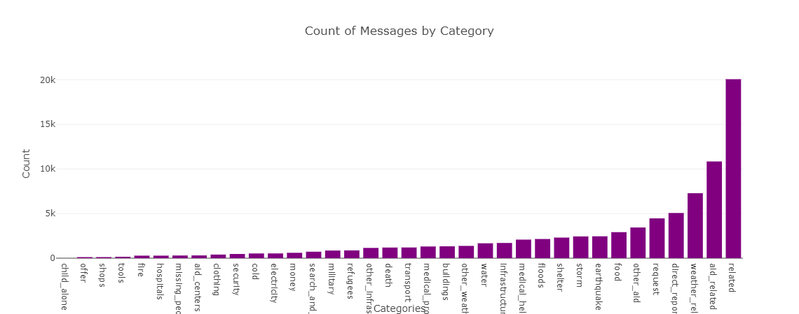

# Disaster_Resp_Pipeline
The scope of this project is to resolve disaster response using the different  elements of the data 
engineering, categorising multiple input and multiple output and finding the score for each category.
The messages and category scores are then plotted graphically, to summarise the visual representation 
of the result.

## Techniques Used
The below given techniques are used for finding the solution
 * ETL  - Extract the data from the *disaster_message.CSV & Categories.csv* clean the data, 
 transform, merge,  remove duplicates and load them back to the SQL database.
 * NLP - follow the NLP to tokenize the text message in the from the SQL DB
 * MLP - use the machine learning pipeline to find the accuracy of the data.

## Project Summary 
* Process Data:
 The script takes the file paths of the two datasets and database, cleans the datasets, 
It merges the messages and categories datasets, splits the categories column into separate, clearly 
named columns, converts values to binary, and drops duplicates and stores the clean data into a SQLite 
database in the specified database file path passed in the argument while executing the script.

* Build ML pipeline:
 The script takes the database file path and model file path, creates and trains a classifier,
 and stores the classifier into a pickle file to the specified model file path.
 The script, train and test the dataset with the pipeline, using Multioutput classifier to
 classify messages into 36 different categories. In conjuction with the above adaboost classifier and gridsearch 
 with few extra hyper parameters are used to increase the accuracy and the score.
 
* create and Run:
 The generated Database from the ETL and the generated pickle file from the MTL is used
 visualise the grphical output to a html.
 
 * Output HTML :
  The page includes two visualizations using data from the SQLite database.
     1. 
     2. 

## File Description
The *data* folder consists of the files 3 differnt files 
* The csv files used for process (disaster_messages.csv, disaster_categories.csv)
* process_data.py - python file which carries out the main ETL processing of the data
* DisasterResponse.db - output file generated by running the process_data.py file, in a suitable IDE for python

The *model* folder consists of 2 different file
* train_classifier.py that uses the DisasterResponse.db as a input file to read the database table 
* classifier.pkl -  is the output pickle file generated by running the train_classifier.py

The folder *app* consists of a folder named template and run.py file. The run.py helps to port the 
plot using plotly on the website.

The folder *JupyterNB* has files, thats used in the classroom for trying out differnt classifiers.

### Instructions to run the python file 
In any suitable python environment, copy or download all the folder, and execute the below given command.

1. Run the following commands in the project's base directory to set up your database and model.

    - To run ETL pipeline that cleans data and stores in database
        <!-- python data/process_data.py data/disaster_messages.csv data/disaster_categories.csv data/DisasterResponse.db -->
    - To run ML pipeline that trains classifier and saves
        <!-- python models/train_classifier.py data/DisasterResponse.db models/classifier.pkl -->

2. Run the following command in the app's directory to run your web app.
    <!-- python app/run.py -->

3. The app can be either execute from the udacity workspace(if you are using the udacity) or 
it can run from local machine. The instructions is given below for both.
#### Udacity workspace -->

1. Run your app with python run.py command
2. Open another terminal and type env|grep WORK this will give you the spaceid (it will start with view*** and some characters after that)
3. Now open your browser window and type <https://SPACEID-3001.SPACEDOMAIN>, replace the spaceid  and spacedomain with your space id spacedomain
that you got in the step 2
4. Press enter and the app should now run for you

#### Local machine
* Once your app is running (python run.py)
* Go to  <http://localhost:3001> and the app will now run

### Reference
The mentors from udacity supported, on various cases, whenever i hit the brickwall. 
Also the errors reported by previous students of the udacity, and some of the answers 
suggested also helped in fixing the errors.

